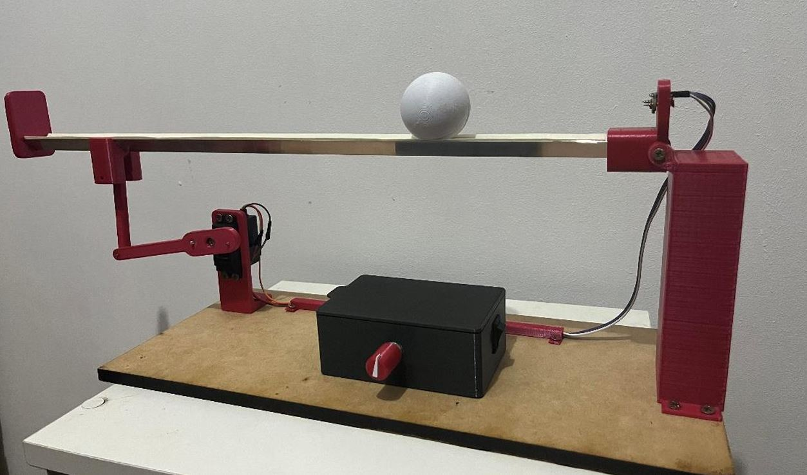
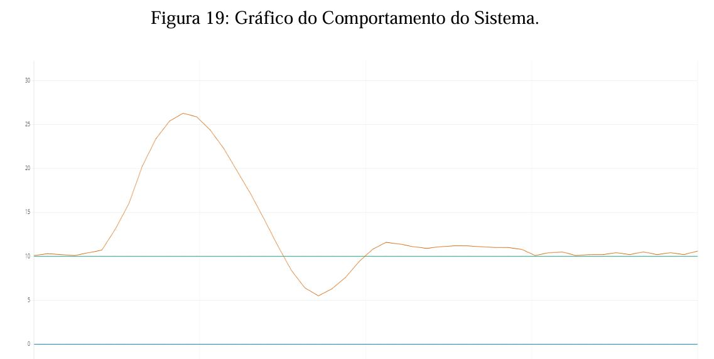
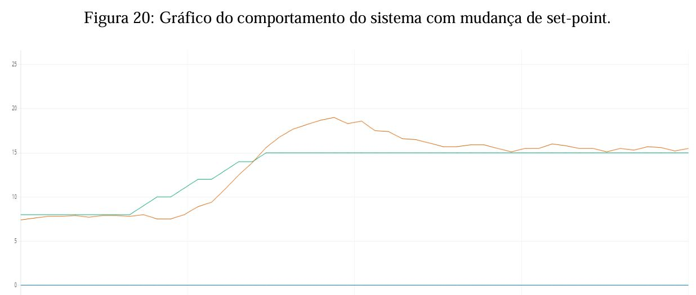

# Ball and Beam Control System

This repository contains my undergraduate final project in **Control and Automation Engineering**, focused on the modeling, simulation, and real implementation of a classic unstable control system: the **Ball and Beam**.

The project integrates **control theory, embedded programming, and experimental validation** using Arduino and MATLAB/Simulink.

---

##  Project Overview

The objective is to control the position of a ball rolling on a beam by adjusting the beam angle through a feedback controller.

Main steps:

- Mathematical modeling of the system  
- Controller design and tuning (PID)  
- Simulation in MATLAB/Simulink  
- Real-time implementation using Arduino  
- Experimental validation and response analysis  

---

## Technologies Used

- **Arduino (C++)** – real-time control  
- **MATLAB/Simulink** – simulation and PID values  
- **Infrared distance sensor** – ball position measurement  
- **Servo motor** – beam actuation  
- **Control theory (PID)** – stabilization and tracking  

---

## Experimental Setup

---

## System Response

### Disturb Response Example

- Green: Set-Point
- Orange: Beam Position

---

## System Response

### Set-point Change Response Example

---

## Demo Video

Watch the system in operation:

**(https://www.youtube.com/watch?v=i4xSG7EOrDw)**

